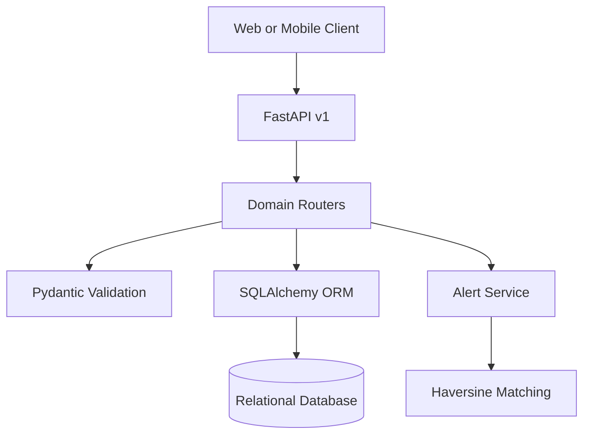
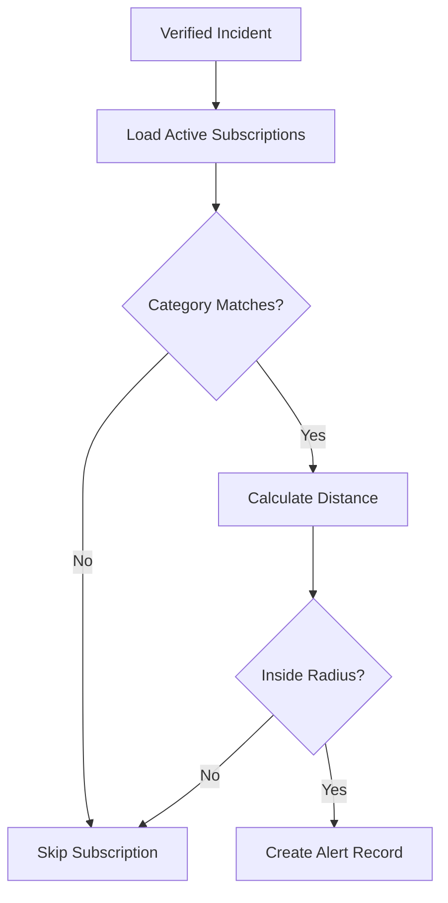
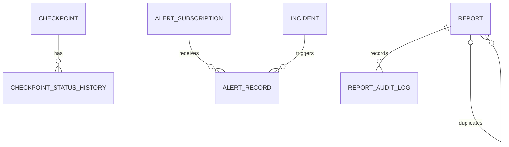

# Wasel Palestine API

<p align="center">
  A community-powered mobility and road-intelligence backend for checkpoints, incidents, crowdsourced reports, and location-aware alerts across Palestine.
</p>

<p align="center">
  
  
  
  
  
  
</p>

## Overview

Wasel Palestine is a REST API for a smart mobility platform designed to help travelers understand changing road conditions. It centralizes checkpoint data, verified incidents, community reports, status history, and regional alert subscriptions behind a versioned FastAPI interface.

The project explores practical backend concepts including modular API design, geospatial distance calculations, duplicate detection, moderation workflows, confidence scoring, audit trails, filtering, sorting, pagination, and environment-based configuration.

> **Project status:** Active development. The core domain modules are implemented, while authentication, route estimation, external integrations, containerization, and broader testing remain on the roadmap.

## Why This Project?

Road conditions can change quickly, while useful information is often scattered across different channels. Wasel Palestine models a single backend platform where applications can:

- Track checkpoints and their status changes
- Publish and query road incidents
- Accept structured reports from the community
- Detect likely duplicate submissions
- Moderate and audit crowdsourced information
- Measure report confidence through voting
- Notify subscribers about nearby verified incidents

## Core Features

### Checkpoint intelligence

- Create, retrieve, update, and delete checkpoints
- Filter checkpoints by city or current status
- Search checkpoint names case-insensitively
- Sort results by ID, name, city, creation time, or status
- Paginate large result sets
- Automatically record the initial checkpoint status
- Preserve a full status-change history with reason and actor
- Return checkpoint details together with historical status records

### Incident management

- Create and manage structured road incidents
- Store category, severity, status, and geographic coordinates
- Filter by category, severity, or status
- Search incidents by title
- Sort by ID, creation time, severity, or category
- Paginate incident results

### Crowdsourced reporting

- Submit categorized reports with optional reporter identity
- Validate descriptions and geographic coordinate ranges
- Detect reports with the same category and coordinates within 30 minutes
- Mark likely repeats as duplicates and link them to the original report
- Moderate reports as pending, verified, rejected, or duplicate
- Record moderator notes and moderation timestamps
- Vote reports up or down
- Recalculate confidence as `upvotes / total votes`
- Store immutable-style audit entries for creation, moderation, and voting events

### Regional alerts

- Create location-based alert subscriptions
- Optionally subscribe to a specific incident category
- Configure an alert radius between 0 and 100 kilometers
- Filter subscriptions by user, area, category, or active state
- Deactivate subscriptions without deleting their data
- Generate alerts only from verified incidents
- Match incidents to subscriptions using the Haversine distance formula
- Retrieve alert records with filtering and pagination
- Mark individual alerts as read

### API and configuration

- Versioned endpoints under `/api/v1`
- Automatic Swagger UI and ReDoc documentation
- SQLAlchemy session lifecycle through FastAPI dependencies
- SQLite database by default
- Configurable database URL through `.env`
- Automatic table creation during application startup
- Health-check endpoint for service monitoring

## Technology Stack

| Area | Technology |
| --- | --- |
| Language | Python |
| API framework | FastAPI |
| ASGI server | Uvicorn |
| ORM | SQLAlchemy 2 |
| Validation | Pydantic 2 |
| Configuration | Pydantic Settings and `.env` |
| Default database | SQLite |
| API style | REST with versioned routes |
| Geospatial logic | Haversine distance calculation |
| Version control | Git and GitHub |

## System Architecture



The application follows a modular structure:

- **API routers** expose versioned domain endpoints.
- **Schemas** validate incoming data and serialize responses.
- **Models** define relational entities and relationships.
- **Services** isolate reusable business logic such as geographic alert matching.
- **Database dependencies** provide one session per request.
- **Settings** load runtime configuration from environment variables.

## Alert Generation Flow



For every active subscription, the service checks the optional category filter and calculates the great-circle distance between the subscriber's coordinates and the incident. An alert is stored only when the incident falls within the configured radius.

## Project Structure

```text
.
├── app/
│   ├── api/
│   │   └── v1/
│   │       ├── endpoints/
│   │       │   ├── alerts.py
│   │       │   ├── checkpoints.py
│   │       │   ├── incidents.py
│   │       │   └── reports.py
│   │       └── api.py
│   ├── core/
│   │   └── config.py
│   ├── db/
│   │   └── database.py
│   ├── models/
│   │   ├── alert.py
│   │   ├── checkpoint.py
│   │   ├── incident.py
│   │   └── report.py
│   ├── schemas/
│   │   ├── alert_schema.py
│   │   ├── checkpoint_schema.py
│   │   ├── incident_schema.py
│   │   └── report_schema.py
│   ├── services/
│   │   └── alert_service.py
│   └── main.py
├── .gitignore
├── requirements.txt
└── README.md
```

## Getting Started

### Prerequisites

- Python 3.10 or newer
- `pip`
- Git

### Installation

1. Clone the repository:

   ```bash
   git clone https://github.com/AhmadAdas21/fastapi-wasel-palestine.git
   cd fastapi-wasel-palestine
   ```

2. Create and activate a virtual environment.

   **Linux, macOS, or WSL**

   ```bash
   python3 -m venv .venv
   source .venv/bin/activate
   ```

   **Windows PowerShell**

   ```powershell
   py -m venv .venv
   .\.venv\Scripts\Activate.ps1
   ```

3. Install the dependencies:

   ```bash
   python -m pip install --upgrade pip
   pip install -r requirements.txt
   ```

4. Optionally create a `.env` file in the project root:

   ```env
   DATABASE_URL=sqlite:///./wasel.db
   ```

   If no value is provided, the application uses the same SQLite URL by default.

5. Start the development server:

   ```bash
   python -m uvicorn app.main:app --reload
   ```

6. Open the application:

   - Base URL: <http://127.0.0.1:8000>
   - Swagger UI: <http://127.0.0.1:8000/docs>
   - ReDoc: <http://127.0.0.1:8000/redoc>
   - Health check: <http://127.0.0.1:8000/health>

The database file and tables are created automatically the first time the application starts.

## API Reference

All domain endpoints use the `/api/v1` prefix.

### General

| Method | Endpoint | Description |
| --- | --- | --- |
| `GET` | `/` | Return the welcome message |
| `GET` | `/health` | Return the service health status |

### Incidents

| Method | Endpoint | Description |
| --- | --- | --- |
| `GET` | `/api/v1/incidents/` | List incidents with filters, sorting, and pagination |
| `GET` | `/api/v1/incidents/{incident_id}` | Retrieve an incident by ID |
| `POST` | `/api/v1/incidents/` | Create an incident |
| `PUT` | `/api/v1/incidents/{incident_id}` | Update an incident |
| `DELETE` | `/api/v1/incidents/{incident_id}` | Delete an incident |

List filters: `category`, `severity`, `status`, `search`, `sort_by`, `skip`, and `limit`.

### Checkpoints

| Method | Endpoint | Description |
| --- | --- | --- |
| `GET` | `/api/v1/checkpoints/` | List checkpoints with filters, sorting, and pagination |
| `GET` | `/api/v1/checkpoints/{checkpoint_id}` | Retrieve a checkpoint with its status history |
| `POST` | `/api/v1/checkpoints/` | Create a checkpoint and its initial history entry |
| `PUT` | `/api/v1/checkpoints/{checkpoint_id}` | Update checkpoint information |
| `PATCH` | `/api/v1/checkpoints/{checkpoint_id}/status` | Change status and record the transition |
| `DELETE` | `/api/v1/checkpoints/{checkpoint_id}` | Delete a checkpoint and its history |

List filters: `city`, `status`, `search`, `sort_by`, `skip`, and `limit`.

### Reports

| Method | Endpoint | Description |
| --- | --- | --- |
| `GET` | `/api/v1/reports/` | List reports with filters, sorting, and pagination |
| `GET` | `/api/v1/reports/{report_id}` | Retrieve a report by ID |
| `POST` | `/api/v1/reports/` | Submit a report and run duplicate detection |
| `PATCH` | `/api/v1/reports/{report_id}/moderate` | Moderate a report and create an audit entry |
| `POST` | `/api/v1/reports/{report_id}/vote?vote=up` | Add an upvote or downvote and recalculate confidence |
| `GET` | `/api/v1/reports/{report_id}/audit` | Retrieve the report's audit history |

List filters: `category`, `status`, `sort_by`, `skip`, and `limit`.

Valid report categories:

```text
closure | delay | accident | weather_hazard | checkpoint | other
```

Valid report statuses:

```text
pending | verified | rejected | duplicate
```

### Alerts

| Method | Endpoint | Description |
| --- | --- | --- |
| `POST` | `/api/v1/alerts/subscriptions` | Create a regional alert subscription |
| `GET` | `/api/v1/alerts/subscriptions` | List and filter subscriptions |
| `DELETE` | `/api/v1/alerts/subscriptions/{subscription_id}` | Deactivate a subscription |
| `GET` | `/api/v1/alerts/` | List alert records |
| `PATCH` | `/api/v1/alerts/{alert_id}/read` | Mark an alert as read |
| `POST` | `/api/v1/alerts/generate/{incident_id}` | Generate matching alerts for a verified incident |

Subscription filters: `user_identifier`, `area_name`, `category`, `active_only`, `skip`, and `limit`.

Alert filters: `subscription_id`, `unread_only`, `skip`, and `limit`.

## Example Requests

### Create a checkpoint

```bash
curl -X POST "http://127.0.0.1:8000/api/v1/checkpoints/" \
  -H "Content-Type: application/json" \
  -d '{
    "name": "Example Checkpoint",
    "city": "Nablus",
    "description": "Checkpoint on a main road",
    "latitude": 32.2211,
    "longitude": 35.2544,
    "current_status": "open"
  }'
```

### Submit a crowdsourced report

```bash
curl -X POST "http://127.0.0.1:8000/api/v1/reports/" \
  -H "Content-Type: application/json" \
  -d '{
    "category": "delay",
    "description": "Heavy traffic and an extended delay in the area.",
    "latitude": 32.2211,
    "longitude": 35.2544,
    "reporter_name": "Anonymous"
  }'
```

### Create an alert subscription

```bash
curl -X POST "http://127.0.0.1:8000/api/v1/alerts/subscriptions" \
  -H "Content-Type: application/json" \
  -d '{
    "user_identifier": "user-123",
    "area_name": "Nablus",
    "category": "closure",
    "latitude": 32.2211,
    "longitude": 35.2544,
    "radius_km": 10
  }'
```

## Data Model



| Entity | Purpose |
| --- | --- |
| `Checkpoint` | Stores checkpoint identity, city, coordinates, and current status |
| `CheckpointStatusHistory` | Records every checkpoint status transition |
| `Incident` | Represents a structured road incident with location and severity |
| `Report` | Stores community-submitted information and confidence data |
| `ReportAuditLog` | Tracks report creation, moderation, and voting actions |
| `AlertSubscription` | Defines a user's area, optional category, and notification radius |
| `AlertRecord` | Stores a generated notification linked to a subscription and incident |

## Business Rules

- Pagination limits are restricted to a maximum of 100 records per request.
- A duplicate report must have the same category and exact coordinates as a report submitted during the previous 30 minutes.
- Report confidence is rounded to two decimal places.
- Only incidents whose status is exactly `verified` can generate alerts.
- A subscription with no category receives matching incidents from every category.
- Deleting an alert subscription deactivates it instead of removing the record.
- Deleting a checkpoint also removes its status history through ORM cascading.

## Configuration

| Variable | Default | Description |
| --- | --- | --- |
| `DATABASE_URL` | `sqlite:///./wasel.db` | SQLAlchemy database connection URL |

The `.env` file and local database files are intentionally excluded from version control.

## Roadmap

- Add JWT authentication and role-based authorization
- Connect crowdsourced reports to the verified incident workflow
- Add route estimation and checkpoint-aware journey planning
- Integrate external routing, traffic, and weather services
- Add Docker and Docker Compose support
- Add automated unit and integration tests
- Add Alembic database migrations
- Add PostgreSQL support for production deployments
- Add structured logging and centralized exception handling
- Document the API in ApiDog
- Add k6 performance and load testing
- Add CI/CD for quality checks and deployment

## Contributing

Contributions and improvement suggestions are welcome.

1. Fork the repository.
2. Create a branch: `git switch -c feature/your-feature`.
3. Commit your work: `git commit -m "Add your feature"`.
4. Push the branch: `git push origin feature/your-feature`.
5. Open a pull request.

## Author

**Ahmad Adas**

- GitHub: [@AhmadAdas21](https://github.com/AhmadAdas21)

---

If you find the project useful or interesting, consider giving the repository a star.
